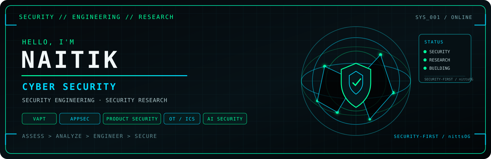
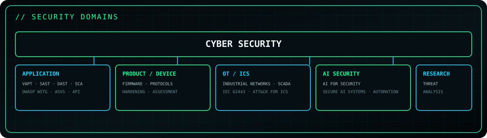
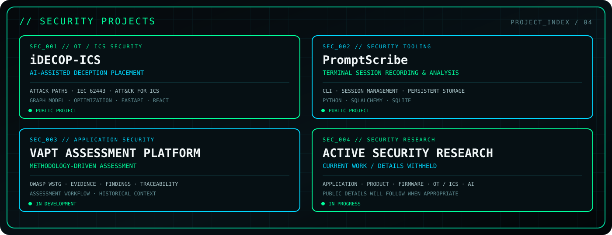

  

<a href="#-system-profile">SYSTEM</a> · <a href="#-security-projects">PROJECTS</a> · <a href="#-security-toolchain">TOOLCHAIN</a> · <a href="#-active-research">RESEARCH</a> · <a href="#-github-telemetry">TELEMETRY</a> · <a href="#-connect">CONNECT</a>

  
  
  

## `// SYSTEM PROFILE`

**M.TECH CYBER SECURITY**  
**SECURITY ENGINEERING / SECURITY RESEARCH**

I work across the security lifecycle — assessing systems, analyzing attack surfaces, building security tooling, and researching how systems can be made more resilient.

`DISCOVER` → `ASSESS` → `ANALYZE` → `MITIGATE` → `VALIDATE`

Security is the primary domain; the technologies and environments below are the areas in which I apply it.

## `// SECURITY PROJECTS`

<b>PROJECT INDEX</b>

| PROJECT | AREA | STATUS |
|---|---|---|
| **[iDECOP-ICS](https://github.com/nittsOG/idecop-ics)** | AI × OT/ICS Security | Public |
| **[PromptScribe](https://github.com/nittsOG/promptscribe)** | Security Tooling | Public |
| **[KAVACH](https://github.com/nittsOG/KAVACH)** | File Integrity / Security | Fork |
| **VAPT Assessment Platform** | Application Security | In Development |

## `// SECURITY TOOLCHAIN`

`VAPT` · `SAST` · `DAST` · `SCA` · `BURP SUITE` · `NMAP` · `WIRESHARK` · `SNORT` · `AUTOPSY` · `FTK IMAGER` · `MODBUS` · `IEC 62443` · `MITRE ATT&CK FOR ICS` · `PYTHON` · `C` · `BASH` · `LINUX` · `DOCKER`

## `// ACTIVE RESEARCH`

`APPLICATION SECURITY` · `PRODUCT SECURITY` · `FIRMWARE SECURITY` · `OT/ICS SECURITY` · `AI SECURITY`

Current focus: practical assessment, attack-surface analysis, secure engineering, and security research. Selected work is public; current/private work will be documented when appropriate.

## `// OPERATING PRINCIPLES`

| PRINCIPLE | APPROACH |
|---|---|
| **Map** | Understand architecture, trust boundaries, attack surface, and assumptions. |
| **Test** | Validate security controls with reproducible technical evidence. |
| **Trace** | Connect observations to impact, remediation, and verification. |
| **Engineer** | Carry security into design, implementation, hardening, and validation. |

## `// GITHUB TELEMETRY`

> Telemetry cards are supplemental; the project and security sections are the primary profile signal.

  
  

## `// CONNECT`

  <code>ASSESS &gt; ANALYZE &gt; ENGINEER &gt; SECURE</code>

